## 这份文档是什么

把 `origin/main` 合到 `origin/garnet-hemisphere` 之后，作为 reconcile 一方主导的工程合并，过程中遇到了几个真冲突，我 (Claude) 按自己理解做了取舍。**这份文档把每个有取舍的决策点都给出 3 列截图（main / 我合的 reconcile 结果 / 原 garnet）让产品看，然后判断这样合是否可接受**。

> 验证状态：reconcile worktree 全仓 `pnpm typecheck` exit=0；daemon 启动 OK；web 启动 OK；3 套实例都在本机相同端口轮流跑过截图。
>
> 截图条件：mock localStorage 把 onboarding 和隐私同意标 done；其它 onboarding modal 偶尔会在右下角覆盖（不影响主区域）。

---

## 决策 #1 · SettingsDialog 是否保留 main 加的 nav-item

### 背景

garnet 这边的产品同学把 Skills / MCP / Connectors / Routines / Integrations 都搬到了**顶级路由** `/integrations` 和 `/automations`，从 SettingsDialog 拿走了。但是同期 main 在 SettingsDialog 里**继续加了**这几个 section（不知道 garnet 已经在做相反的事）。

合并时两边在 `SettingsDialog.tsx` 上有 2 个冲突 hunk，本质都是 "garnet 删掉 nav-item / main 加 nav-item" 同位置冲突。

### 我的合并

**保留 main 加的 nav-item**，理由：
- `activeSection === 'skills' | 'routines' | 'integrations'` 等渲染分支在 SettingsDialog 内部已经存在
- 删掉 nav-item 但保留渲染分支会变 dead code
- 顶级路由 `/integrations` 和 `/automations` 同时存在 ≠ 必须删 dialog 入口
- 产品验证阶段两个入口并存最安全

### 截图三联

**main（合并前）— SettingsDialog 长这样**

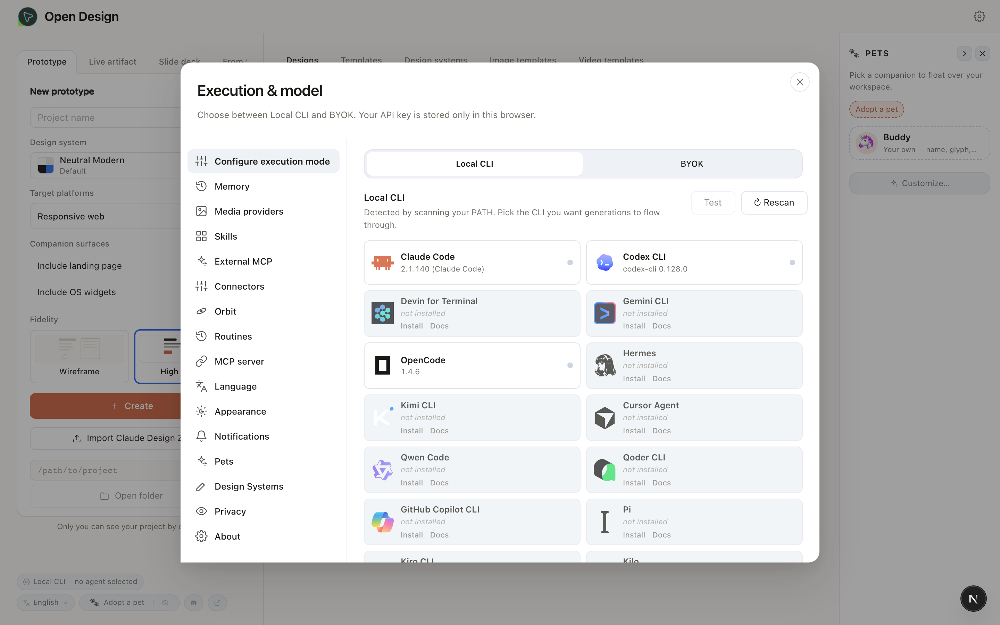

> 9 条 nav：执行模式 / Memory / Media providers / **Skills** / **External MCP** / **Connectors** / Orbit / **Routines** / Language / Appearance / Notifications / Pets / Design Systems / Privacy / About。

**我合的 reconcile 结果 — SettingsDialog**

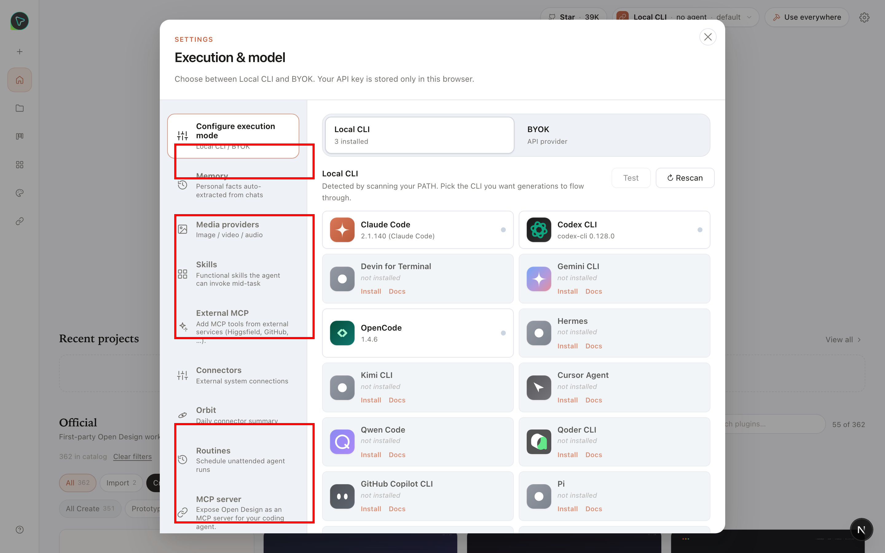

> 红框 = main 在 SettingsDialog 里加的、garnet 自己 dialog 中**没有**的 section。reconcile 全部保留了。

**原 garnet — SettingsDialog**

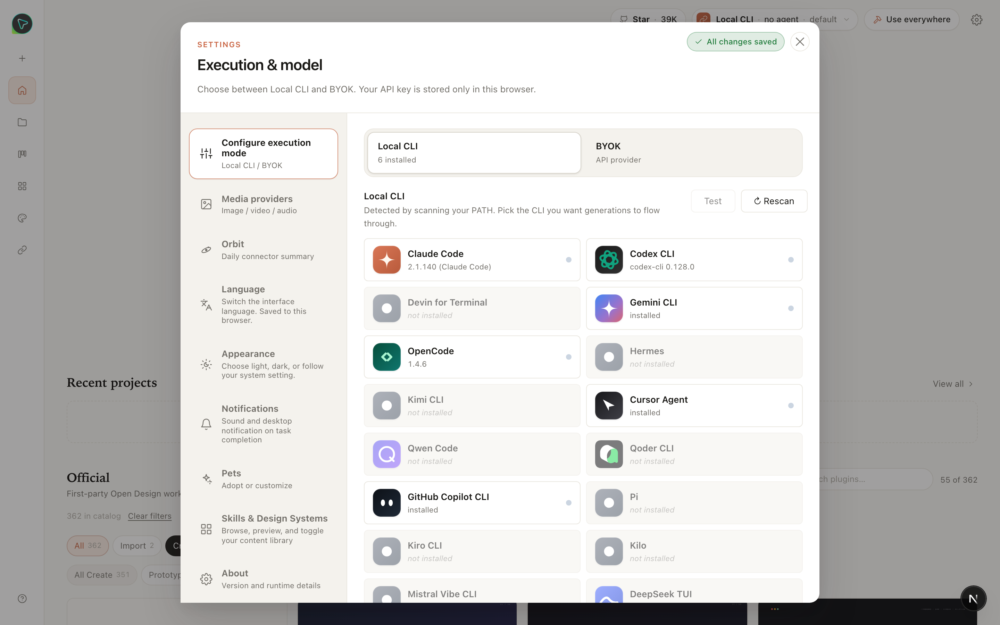

> garnet 只有 9 条精简 nav：执行模式 / Media providers / Orbit / Language / Appearance / Notifications / Pets / **Skills & Design Systems**（合并条目）/ About。没有 Memory / 单独 Skills / External MCP / Connectors / Routines / MCP server。**到达入口要去顶右 ⚙ dropdown → "Settings"**（多一层导航）。

### 给产品的问题

| 选项 | 含义 |
|---|---|
| **接受**（保留所有 main nav-item） | 短期最安全。两个入口并存：顶级路由（推荐）+ Settings dialog（旧入口仍工作）。Track A/B 完成后再考虑是否清掉 dialog 重复入口 |
| **改成** garnet 风格（只保留 9 条精简 nav） | 强迫用户走顶级路由。**风险**：Track A（Skills 顶级路由实现）、Track B（Automations 顶级路由实现）必须先完成，否则用户访问 Skills/Routines 时**无入口** |

---

## 决策 #2 · EntryView 是否接受 garnet 改写成 EntryShell wrapper

### 背景

main 上 `EntryView.tsx` 是 700+ 行的完整 home 实现（侧栏 New prototype 面板 + 中间 designs/templates/design-systems/image-templates/video-templates 5 个 tab + 右栏 PetRail）。

garnet 把它**重写成一个薄 wrapper**，全部 props 转发给新的 `EntryShell` 组件（HomeHero 风格、左侧 nav rail、卡片化 plugin grid）。

5 个 hunk 总共 ~500 行冲突。

### 我的合并

**接受 garnet 的 EntryShell wrapper**，理由：
- garnet 已经投入了大量工作做新 home 体验（HomeHero + plugin marketplace 风格）
- main 在原 EntryView 上的增量改动（PetRail / image-templates / video-templates 两个 tab）属于"叠加新功能"，丢失后**作为 follow-up 单独接到 EntryShell 上**比反向重写代价小

**代价**：main 上的 PetRail 侧栏、image-templates / video-templates 两个 tab 当前**没接入 EntryShell**，需要 follow-up PR 补回。

### 截图三联

**main — home（合并前）**

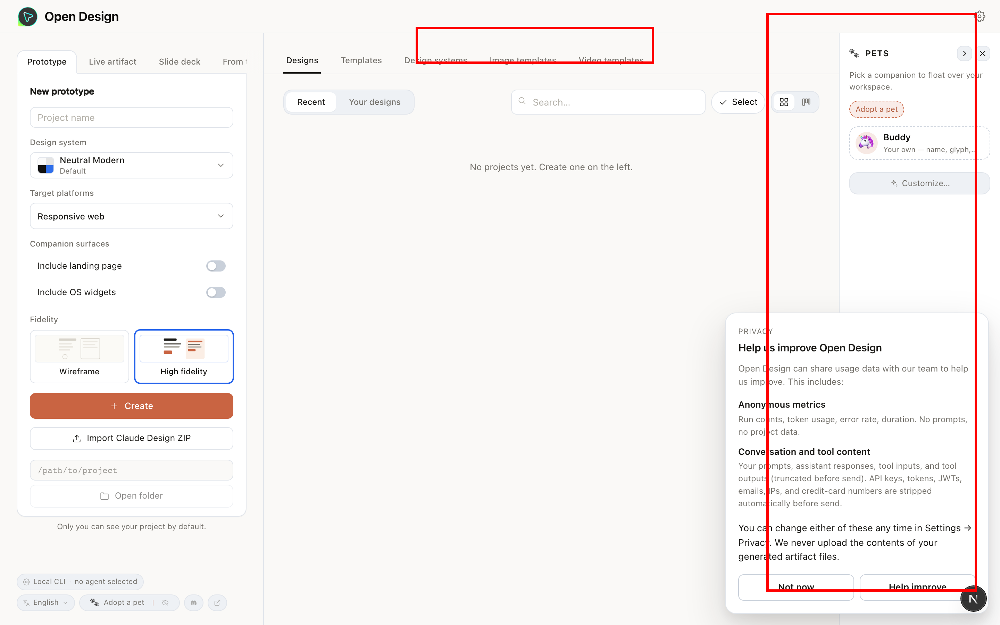

> 红框 = main 上有但 garnet/reconcile 现在没有的 UI：**右侧 PetRail 侧栏**（宠物列表）+ **顶部 image-templates / video-templates 两个额外 tab**。

**我合的 reconcile 结果 — home**

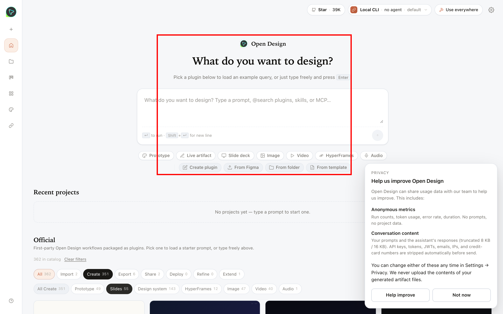

> 红框 = garnet 的 HomeHero "What do you want to design?" + plugin/skill 入口卡片 + 类型 chips（Prototype / Live artifact / Slide deck / Image / Video / HyperFrames / Audio）。**没有 PetRail**，**也没有 image/video-templates tab**。

**原 garnet — home**

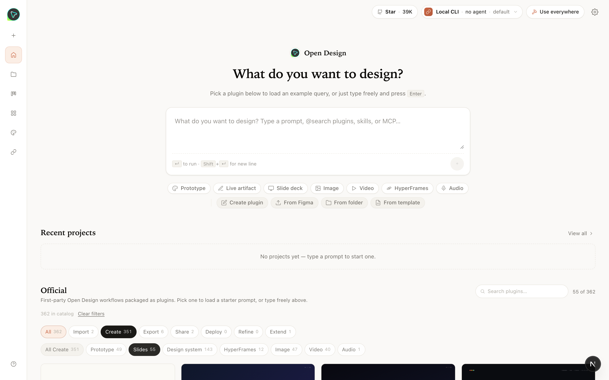

> 和 reconcile 完全一致（接受 garnet wrapper 的直接证据）。

### 给产品的问题

| 选项 | 含义 |
|---|---|
| **接受**（garnet 的 EntryShell + PetRail / image/video-templates 后补） | 保留 garnet 的新 home 设计；丢失项进 follow-up 队列 |
| **回退** main 的 EntryView | 丢失 garnet 投入的整套 HomeHero / 卡片化 plugin 入口。不推荐 |

---

## 决策 #3 · /integrations 和 /automations 顶级路由是否保留

### 背景

`/integrations` 和 `/automations` 是 garnet 独有的新路由（main 上没有）。合并时**不构成冲突**（main 没碰过这两个文件），但产品需要确认这套 UI 路由是否要保留作为核心导航。

### 我的合并

**保留**（garnet 原样）。

### 截图三联

**main — `/integrations` 路由**

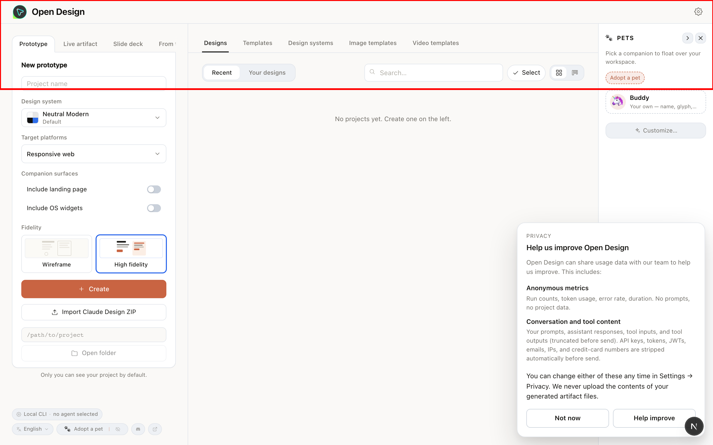

> 红框 = URL 是 `/integrations` 但页面 fallback 回了 home —— **main 上根本没有这条路由**，路由匹配失败默认渲染 home。

**我合的 reconcile 结果 — `/integrations`**

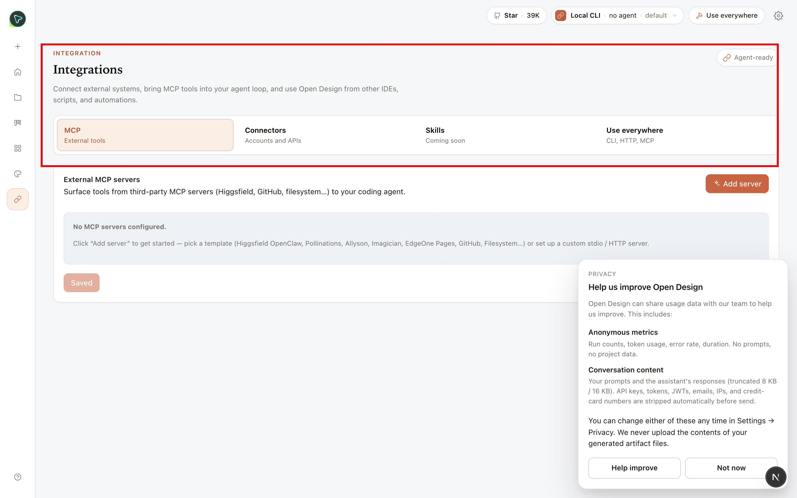

> 红框 = 完整的 IntegrationsView：4 个 tab（**MCP** / **Connectors** / **Skills - Coming soon** / **Use everywhere**）+ External MCP servers 面板。
>
> **Skills tab 当前是占位**（"Coming soon"），等 Track A（席瑞）接入 main 的 SkillsSection 后才能用。

**原 garnet — `/integrations`**

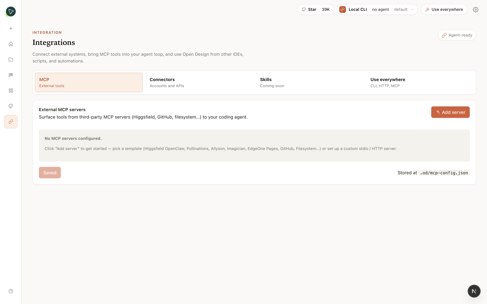

> 和 reconcile 一致。

---

### `/automations` 同理

**main — `/automations`**

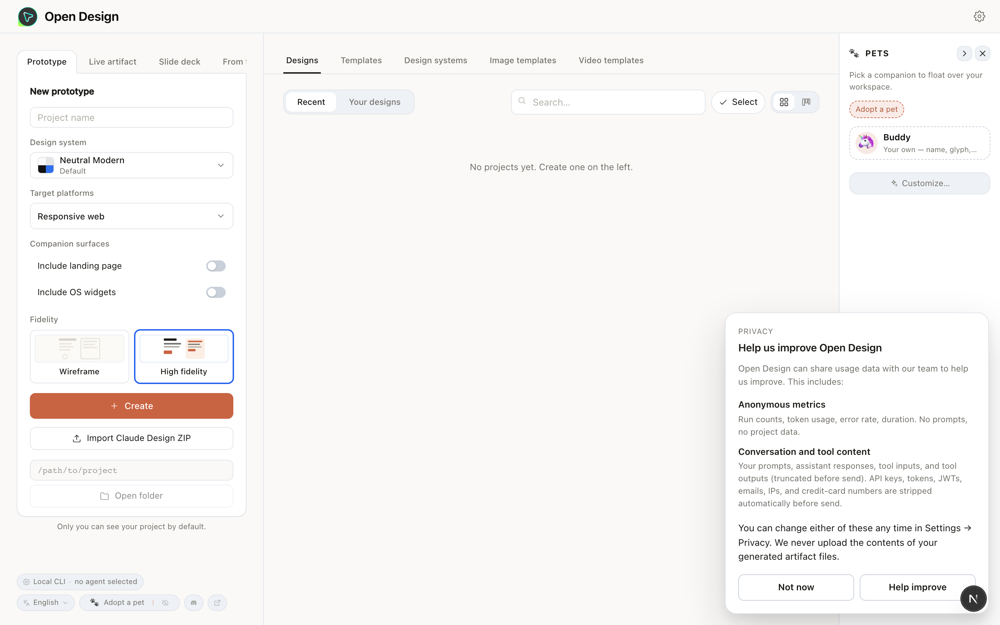

> 也 fallback 回了 home。**main 上也没有 `/automations`**。

**我合的 reconcile 结果 — `/automations`**

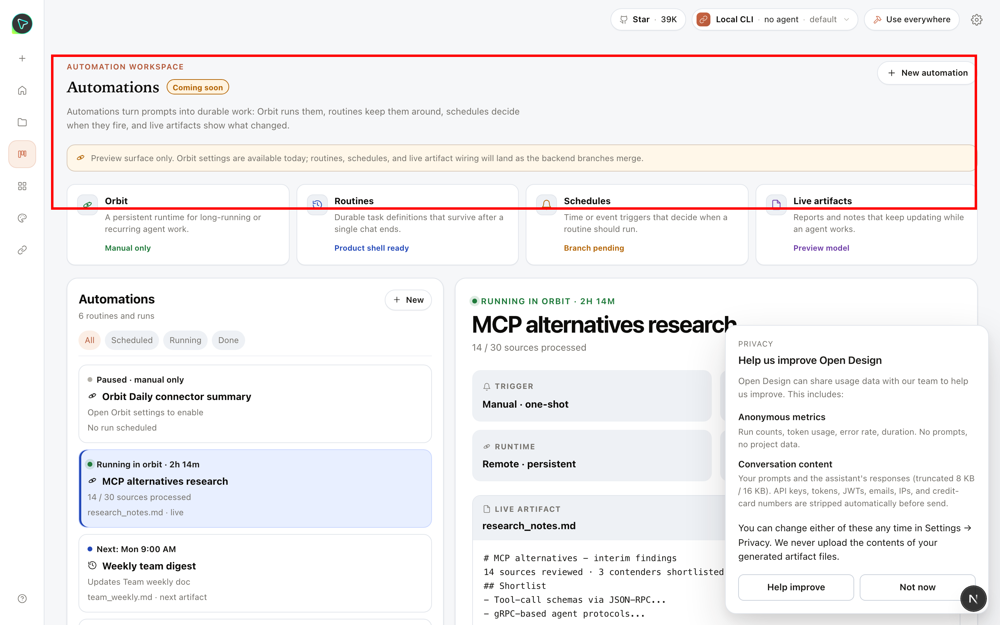

> 完整的 Automation workspace：标题 + lede + 4 张 Primitive 卡片（Orbit / Routines / Schedules / Live artifacts）+ 中间 mock automation list + 右侧 mock task detail（MCP alternatives research）。
>
> **Routines / Schedules / Live artifacts 三张卡当前是 mock**，需要 Track B（麻薯）把 main 的 routines / live-artifacts 后端接上。

**原 garnet — `/automations`**

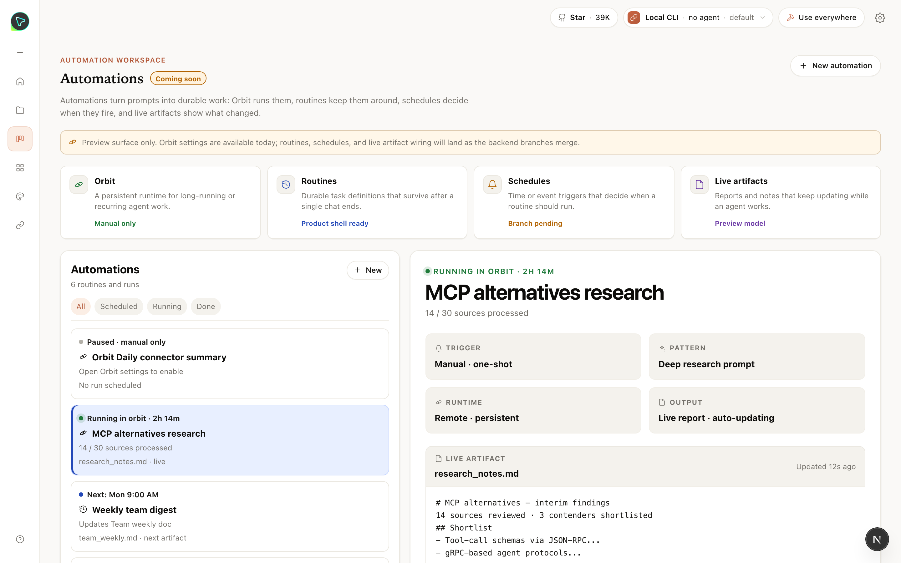

> 和 reconcile 一致。

### 给产品的问题

| 选项 | 含义 |
|---|---|
| **接受** 顶级路由（推荐） | 两个新页面成为正式入口；Track A/B 补齐占位/mock 内容后就完整可用 |
| **不要** 顶级路由（按 main 的形态） | Skills/Routines/Integrations 全部留在 SettingsDialog 里。**garnet 的 IntegrationsView / TasksView 全部 ~550 行废弃** |

---

## 决策 #4 · ProjectView pendingPrompt 处理

### 背景

main 的 `initialDraft` state 是 `{ projectId, value } | undefined`（scoped state，跨 conversation 不重 seed）；garnet 的是 `string | undefined`（用 `autoSendSeedRef` ref 单独处理 PluginLoopHome auto-send 场景）。

### 我的合并

两套合并：用 main 的 scoped state shape + 嵌入 garnet 的 `autoSendSeedRef` 检测逻辑。

**没有 UI 截图——这是行为差异**。需要等 Track B 起来后跑一次 PluginLoopHome → 项目创建 → 看 chat composer 是否被正确 seed（不该 echo 已发送的 prompt）。

### 给产品的问题

无需产品决策。这是工程实现细节，行为对用户透明。

---

## 决策 #5 · DesignFilesPanel UI 谁胜出

### 背景

garnet 的 DesignFilesPanel 是 "by-kind sections + plugin folders" 渲染。main 加了 "pagination + 分页表格" 渲染。**结构性冲突**：两套不能同时存在。

### 我的合并

**接受 main 的 pagination 渲染**，理由：
- 合并后的代码中，pagination state（`page` / `pageSize` / `safePage`）被组件其它部分大量引用
- garnet 的 by-kind sections 渲染丢失，需要 follow-up 补回

**没有截图**——需要一个有真实项目 + 真实文件的环境才能演示。当前空状态下两边视觉一样。

### 给产品的问题

| 选项 | 含义 |
|---|---|
| **接受** main 的 pagination | 顺手；garnet 的 plugin-folders 渲染 + 按 kind 分组 follow-up 补 |
| **要求**保留 garnet 的 by-kind + plugin folders | 需要把 main 的 pagination 改成 optional 模式，工程量中等 |

---

## 决策 #6 · scripts/guard.ts 路径

`skills/html-ppt-zhangzara-*` (garnet) vs `design-templates/html-ppt-zhangzara-*` (main)。**main 路径胜出**——因为 PR #955 在 main 上做了 skills/design-templates 拆分，目录已经搬过去了，garnet 路径已失效。garnet 自带的 `plugins/_official/examples/...` allowlist 保留。

无需产品决策。

---

## 决策 #7 · server.ts (~5400 行冲突区，10 hunks)

后端核心文件。我做了 10 个 hunk 的逐个手工合并。详细决策见 [`spec.md`](./spec.md) 末尾的 server.ts hunk 表。

**结果**：
- ✅ daemon typecheck pass
- ✅ daemon 实际启动 OK（reconcile worktree 端口 17656 健康响应 `/api/daemon/status`）
- ✅ `/api/integrations` `/api/routines` `/api/skills` `/api/projects` 等核心路由都在
- 🟡 **遗留**：garnet 的 plugin snapshot 解析逻辑（默认 scenario fallback、template 文件 seed）在合并时被剥离，需要 follow-up 重新集成到 `project-routes.ts`
- 🟡 **遗留**：garnet 的 inline 路由 vs main 的 modular `registerProjectRoutes` 可能有 duplicate 注册——本机启动没报错，但跑全套 e2e 才能确认

无需产品决策——这是工程实现细节。

---

## 总体判断

| 决策 | 接受 reconcile 的合并方式? | 我的把握 |
|---|---|---|
| #1 SettingsDialog 保留 main nav-item | 待产品确认 | **倾向接受**（最低破坏） |
| #2 EntryView → EntryShell wrapper | 待产品确认 | **倾向接受**（保留 garnet 投入） |
| #3 `/integrations` `/automations` 顶级路由 | 待产品确认 | **倾向接受**（garnet 设计意图） |
| #4 pendingPrompt 合并 | 无需 | 高（两边逻辑都保留） |
| #5 DesignFilesPanel | 待产品确认 | 中（丢失 garnet plugin-folders 渲染） |
| #6 guard.ts 路径 | 无需 | 高 |
| #7 server.ts (10 hunks) | 无需 | 中（typecheck + 启动 OK，但 garnet plugin 路由完整性待测） |

**两个 follow-up 队列**：
1. **必须做**：Track A（Skills tab 接真组件）+ Track B（Automations 卡片接真数据）—— 否则顶级路由的"Coming soon" 一直占着
2. **建议做**：PetRail / image-templates / video-templates / DesignFilesPanel plugin-folders / project plugin snapshot 解析 —— 这些是 reconcile 过程中为了完成合并而暂时丢弃的 main 或 garnet 功能，产品确认重要性后排单独 PR

---

## 想看更多细节？

- 完整 spec：[`spec.md`](./spec.md)
- 截图源文件：[`./screenshots/main/`](./screenshots/main/) / [`./screenshots/reconcile/`](./screenshots/reconcile/) / [`./screenshots/garnet/`](./screenshots/garnet/)
- 复现 reconcile worktree：`/Users/elian/Documents/open-design-garnet` 分支 `garnet-hemisphere`（未 commit，merge in progress）
